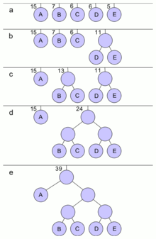
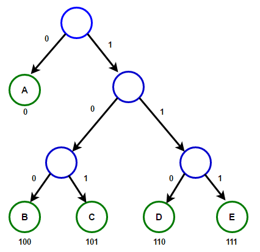
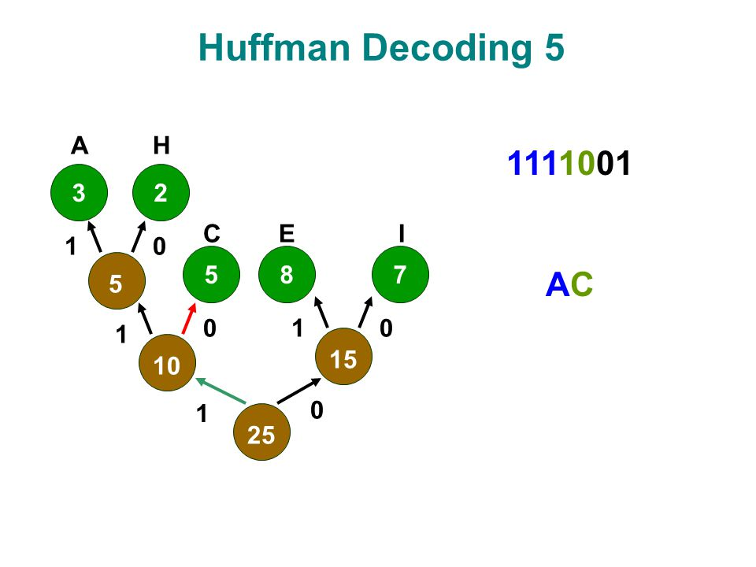

# Huffman Code :bowtie:
## 1. Huffman Algorithm 


*  It's an algorithm developed by **David A. Huffman**  while he was a  student at MIT, and published in the **1952** paper **"A Method for the Construction of Minimum-Redundancy Codes"**


* Huffman coding is a lossless data compression algorithm. 
* The idea is to assign variable-length codes to input characters, lengths of the assigned codes are based on the frequencies of corresponding characters. 
*  The most frequent character gets the smallest code and the least frequent character gets the largest code.
* In this algorithm we use tree , maps and priority queue .

There are mainly two major parts in Huffman Coding...
1) Build a Huffman Tree from input characters.
2) Traverse the Huffman Tree and assign codes to characters.

for implementation we use the struct node ..

```c++
struct Node
    {
        char data;
        int freq;
        Node *left;
        Node *right;
        Node(char data, int freq)
        {
            left = right = NULL;
            this->data = data;
            this->freq = freq;
        }
    };
```

----------------------------
## 2. Huffman Compression

### **Steps to build Huffman Tree** :evergreen_tree:

1. Create a leaf node for each unique character and build a min heap of all leaf nodes 
     *  Min Heap is used as a priority queue. The value of frequency field is used to compare two nodes in min heap. Initially, the least frequent character is at root.
2.  Extract two nodes with the minimum frequency from the min heap.
3. Create a new internal node with frequency equal to the sum of the two nodes frequencies. Make the first extracted node as its left child and the other extracted node as its right child. Add this node to the min heap.

4. Repeat steps#2 and #3 until the heap contains only one node. The remaining node is the root node and the tree is complete.

 

* **Implementation**
```c++
void HuffmanCodes(char data[], int freq[], int size)
    {
        struct Node *left, *right, *top;

        std::priority_queue<Node *, std::vector<Node *>, compare> minHeap;

        for (int i = 0; i < size; ++i)
            minHeap.push(new Node(data[i], freq[i]));

        while (minHeap.size() != 1)
        {

            left = minHeap.top();
            minHeap.pop();

            right = minHeap.top();
            minHeap.pop();

            top = new Node('$', left->freq + right->freq);

            top->left = left;
            top->right = right;

            minHeap.push(top);
        }
        printCode(minHeap.top(), "");
    }
```


### **Steps to print codes from Huffman Tree:** :keycap_ten:

* Traverse the tree formed starting from the root. 
* Maintain an auxiliary array. While moving to the left child, write 0 to the array. While moving to the right child, write 1 to the array. 
* Print the array when a leaf node is encountered.

    


    

* **Implementation**

```c++
 struct compare
    {
        bool operator()(Node *l, Node *r)
        {
            return (l->freq > r->freq);
        }
    };
```


```c++
void makeDictionary(Node *root, std::string str, std::map< char , std::string > &dictionary )
{
    if (root == nullptr)
        return;

    else  if (root->data == '$')
    {
        makeDictionary(root->left, str + "0", dictionary);
        makeDictionary(root->right, str + "1", dictionary);
    }

    else if (root->data != '$')
    {
        dictionary.insert ( std::pair<char,std::string>(root->data,str) );
        makeDictionary(root->left, str + "0", dictionary);
        makeDictionary(root->right, str + "1", dictionary);
    }
}
```
```c++
std::string encode(std::string input, std::map<char, std::string> dictionary)
{
    int index=0;
    std::string compressedText;
    while ( index < input.size())
    {
        std::string newCode = dictionary.find(input[index])-> second;
        index++;
        compressedText = compressedText + newCode;
    }
    return compressedText;
}
```

**Time complexity:**  :clock3:
 * O(nlogn) 
     * where n is the number of unique characters. If there are n nodes, extractMin() is called 2*(n – 1) times. extractMin() takes O(logn) time as it calles minHeapify(). So, overall complexity is O(nlogn).

    ------------------------
 ## 3. Huffman Decompression
* To decode the encoded data we require the Huffman tree. 
* We iterate through the binary encoded data. To find character corresponding to current bits, we use following simple steps.

    1. We start from root and do following until a leaf is found.
    2. If current bit is 0, we move to left node of the tree.
    3. If the bit is 1, we move to right node of the tree.
    4. If during traversal, we encounter a leaf node, we print character of that particular leaf node and then again continue the iteration of the encoded data starting from step 1.

    

* **Implementation**
```c++
std::string Decomp(std::string input, Node *tree)
{
    int index = 0;
    std::string output;
    while (index < input.size())
    {
        Node *NodePtr = tree;
        while (NodePtr->left != NULL && NodePtr->right != NULL)
        {
            if (input[index] == '1')
            {
                NodePtr = NodePtr->right;
                index++;
            }
            else if (input[index] == '0')
            {
                NodePtr = NodePtr->left;
                index++;
            }
        }
        output.push_back( NodePtr->data );
    }

    return output;
}
```